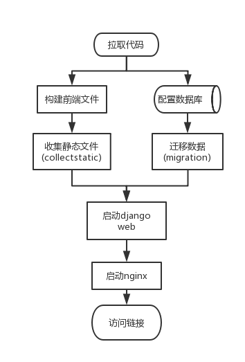

# 使用docker-compose搭建django+vue工程

随着虚拟化技术的发展，越来越多的web工程采用docker进行部署运维。我们尝试使用docker-compose编排一个后端基于django，前端基于vue，数据库为postgresql并使用nginx进行反向代理的web工程。

## 工程准备

### Docker

* [安装Docker](https://docs.docker.com/v17.09/engine/installation/)
* [安装docker-compose](https://docs.docker.com/compose/install/#install-compose)
* 安装docker swarm(可选)

### django

1. 在python3.7的环境下创建 `django-admin startproject dockerdemo`
2. 创建一个简单的app `django-admin startapp account`
3. 修改settings.py文件
   * 修改 `DEBUG=False`
   * `ALLOWED_HOSTS = ['127.0.0.1', 'web']`
   * 将静态文件收集路径添加进 `STATIC_ROOT`，笔者设置为static
   * 添加 `STATICFILES_DIRS`，此项配置后 django 的 `collectstatic` 会在此路径下收集静态文件到 `STATIC_ROOT` 的路径中去。
   * 修改数据库信息（可选），针对实际使用的数据库进行配置，也可以采用django默认的sqlite，笔者此处演示了postgresql的简单配置
   * TEMPLATES下的DIRS配置为 `os.path.join(BASE_DIR, 'web', 'dist')`

### vue

1. 使用vue-cli3创建了一个简单的vue工程
2. 配置 `npm run build` 的静态文件目录到 dist/static 中

### nginx

准备nginx的配置文件，进行静态文件和端口转发的设置。

## 镜像和编排

我们先确定一下部署一个web工程所需要的环节。在这里笔者绘制了一张流程图。

按照流程图的顺序，我们编写一下Dockerfile和docker-compose.yml

### vue

前端的逻辑比较简单，我们只需要利用npm构建一下前端文件即可。需要注意的是，由于国内网络环境的问题，npm需要配置一下镜像仓库，这里我们使用的是淘宝的镜像

### 数据库

数据库需要先准备一下web工程使用的用户和数据库，这里涉及到一个点，就是如何初始化数据库的问题。这里以postgresql举例。官方文档中提供了两种示例，一种是配置环境变量：
* POSTGRES_DB
* POSTGRES_USER
* POSTGRES_PASSWORD

另一种是将初始化脚本拷贝进/docker-entrypoint-initdb.d/ 中，镜像在初始化的时候会执行文件夹下的所有脚本，我们可以在脚本中创建数据库和用户。

### django

我们以python:3.7作为基础镜像。pip安装一下依赖，另外在安装一下gunicorn。由于如果在windows环境下进行开发，gunicorn是无法安装的，所以我们这里单独放进Dockerfile中进行安装。

### nginx

最后便是nginx了，我们需要准备一份配置文件，监听80端口

## 参考链接

* https://stackoverflow.com/questions/33322103/multiple-froms-what-it-means